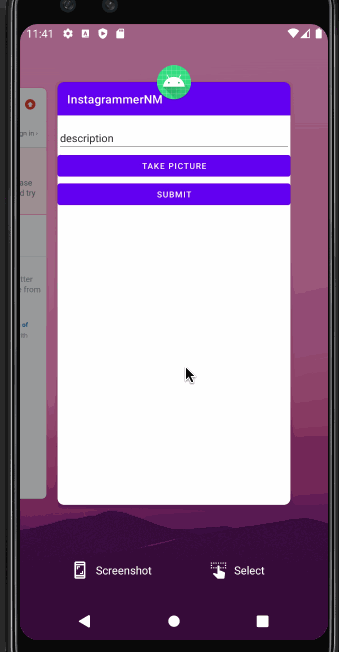

# Unit5-Instagram
Project 3 - *Instagram*

*Unit5* is a photo sharing app similar to Instagram but using Parse as its backend.

Time spent: **4** hours spent in total

## User Stories

The following **required** functionality is completed:

- [x] User can sign up to create a new account using Parse authentication.
- [ ] User can log in and log out of his or her account.
- [x] The current signed in user is persisted across app restarts.
- [ ] User can take a photo, add a caption, and post it to "Instagram".

The following **optional** features are implemented:

- [ ] User sees app icon in home screen and styled bottom navigation view
- [ ] Style the feed to look like the real Instagram feed.
- [ ] After the user submits a new post, show an indeterminate progress bar while the post is being uploaded to Parse.

The following **additional** features are implemented:

- [ ] List anything else that you can get done to improve the app functionality!

## Video Walkthrough

Here's a walkthrough of implemented user stories:

GIF created with [LiceCap](http://www.cockos.com/licecap/).
